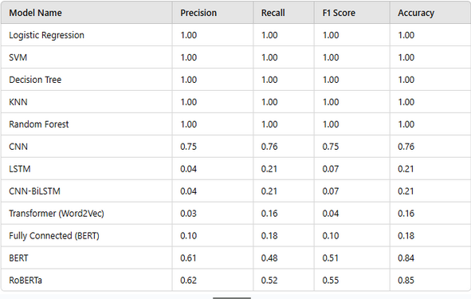

# Ecommerce Product Classification Project

## Course: NLP (Semester 6) - Pillai College of Engineering

### Project Overview
Ecommerce Product Classification project employs a three-tiered approach to product classification: one component fine-tunes large language models (BERT and RoBERTa) using transfer learning, another integrates deep learning techniques by combining traditional vectorization methods (BoW, TF-IDF) with neural embeddings (FastText, Word2Vec, BERT), and the final component leverages classical machine learning models on manually engineered NLP features alongside vectorized text.

## Acknowledgements
We would like to express our sincere gratitude to the following individuals:

**Theory Faculty:**  
- Prof. Dhiraj Amin  
- Dr. Sharvari Govilkar  

**Lab Faculty:**  
- Prof. Dhiraj Amin  
- Prof. Neha Ashok  
- Prof. Shubhangi Chavan  

Their guidance and support have been invaluable throughout this project.

---

## Project Abstract
In retail and e-commerce, product categorization is an essential operation that facilitates effective product arrangement and retrieval. The objective of this project is to use textual data—more especially, product descriptions and the categories that go with them—to create a machine learning-based model for product classification. The dataset contains two columns, namely, description and category. Tokenization, stopword elimination, and lemmatization are steps in the preprocessing pipeline that turn text into structured word arrays, which would be done on a “Description” labelled column. The right category for a particular product will then be predicted  through the best model by machine learning, deep learning or LLM. The suggested method improves product classification accuracy and automation, which benefits user experience and searchability.

---

## Algorithms Used

### Machine Learning Algorithms
- Logistic Regression
- Support Vector Machine (SVM)
- Random Forest Classifier

### Deep Learning Algorithms
- Convolutional Neural Networks (CNN)
- Bidirectional Long Short-Term Memory (BILSTM)
- Long Short-Term Memory (LSTM)
- Gated Recurrent Unit (GRU)
- Multilayer Perceptron (MLP)

### Language Models
- ROBERTA (Robustly Optimized BERT Approach)
- BERT (Bidirectional Encoder Representations from Transformers)

---

## Comparative Analysis
The comparative analysis of different models highlights their effectiveness in classifying loan applications. The following table summarizes the accuracy, precision, recall, and F1-score of the models tested:

<!---->

| Model Name                 | Precision | Recall | F1 Score | Accuracy |
|----------------------------|-----------|--------|----------|----------|
| Logistic Regression        | 1         | 1      | 1        | 1        |
| SVM                        | 1         | 1      | 1        | 1        |
| Decision Tree              | 1         | 1      | 1        | 1        |
| KNN                        | 1         | 1      | 1        | 1        |
| Random Forest              | 1         | 1      | 1        | 1        |
| CNN                        | 0.75      | 0.76   | 0.75     | 0.76     |
| LSTM                       | 0.04      | 0.21   | 0.07     | 0.21     |
| CNN-BiLSTM                 | 0.04      | 0.21   | 0.07     | 0.21     |
| Transformer(word2Vec)      | 0.03      | 0.16   | 0.04     | 0.16     |
| BERT                       | 0.61      | 0.48   | 0.51     | 0.84     |
| Fully Connected(BERT)      | 0.1       | 0.18   | 0.1      | 0.18     |
| RoBERTa                    | 0.62      | 0.52   | 0.55     | 0.85     |

## Conclusion:

This study evaluated the efficacy of various machine learning approaches, encompassing classical algorithms, deep learning architectures, and large language models, for the task of categorizing products from their textual descriptions.  Traditional machine learning methods, including Logistic Regression, SVM, Decision Tree, KNN, and Random Forest, demonstrated exceptional performance, though this consistency might point towards potential overfitting or limitations inherent in the dataset.  Among deep learning models, Convolutional Neural Networks (CNNs) proved most effective in extracting meaningful text features, achieving a respectable accuracy of 76.16%.  However, Recurrent Neural Networks (LSTMs), combined CNN-BiLSTMs, and Transformer models utilizing word embeddings struggled to effectively classify the text.  Large language models, specifically BERT and RoBERTa, exhibited superior performance compared to traditional deep learning models, with RoBERTa showing a slight edge over BERT and thus presenting a promising option for practical implementation.  Furthermore, the project highlighted the critical importance of text preprocessing techniques, such as tokenization, stop word removal, and lemmatization, in enhancing the precision of product classification.

**Learn more about the college:** [Pillai College of Engineering](https://www.pce.ac.in/)
